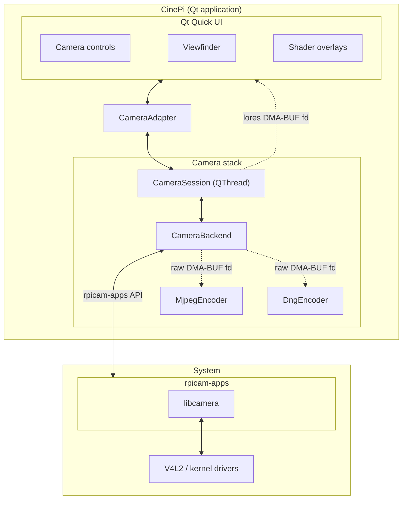

***Open-source cinema camera platform for Raspberry Pi - Kurokesu edition of [CinePI](https://github.com/cinepi/cinepi-sdk)***


# Overview

A fork and evolution of CinePI. Built directly on libcamera. Camera capture, DNG encoding, and Qt Quick UI all run in a single process with DMA-BUF zero-copy preview.

- **Qt Quick UI** running in Cage Wayland kiosk
- **DMA-BUF viewfinder** - zero-copy camera preview via EGL/GLES
- **12-bit CinemaDNG RAW** recording to NVMe SSD
- **GPU shader overlays** - zebra, false color, focus peaking, grayscale
- **Composition guides** - rule of thirds, crosshair, cinematic aspect ratios
- **MJPEG streaming** for remote monitoring

# Supported hardware

CinePI cameras are based around Raspberry Pi hardware / software.

1st party camera modules from Raspberry Pi are supported out of the box. 3rd party sensor modules from [Will Whang](https://github.com/will127534) and [Soho Enterprise](https://soho-enterprise.com/) are also supported.

## Mainboards

- Raspberry Pi 5 (4 GB / 8 GB)

## Image sensor modules


*HQ Camera Module, StarlightEye, OneInchEye, SE-SB8M-IMX585*
- [Raspberry Pi HQ Camera ( IMX477 )](https://www.raspberrypi.com/products/raspberry-pi-high-quality-camera/)
- [Raspberry Pi Camera Module 3 ( IMX708 )](https://www.raspberrypi.com/products/camera-module-3/)
- [OneInchEye ( IMX283 )](https://github.com/will127534/OneInchEye)
- [StarlightEye ( IMX585 )](https://github.com/will127534/StarlightEye)

# Install (fresh Pi)

1. Flash [Raspberry Pi OS Lite Trixie](https://www.raspberrypi.com/software/) (64-bit, Debian 13) to a microSD card.

2. Clone and run the installer:

```bash
git clone https://github.com/Kurokesu/cinepi-kurokesu.git
cd cinepi-kurokesu
sudo ./install.sh
```

Installer steps:

- Installs APT dependencies
- Builds `cinepi` (release)
- Mounts NVMe storage at `/media/RAW`
- Silences kernel boot messages and shows a Plymouth splash
- Caps journald disk usage
- Enables `cinepi.service` to auto-start on boot
- Symlinks `cinepictl` into `/usr/local/bin`

3. Edit boot configuration:

```bash
sudo nano /boot/firmware/config.txt
```

Make three changes:

1. Find `camera_auto_detect` near the top and set it to `0`:

```ini
camera_auto_detect=0
```

2. Find `display_auto_detect` below and set it to `0`:

```ini
display_auto_detect=0
```

3. Add sensor and display overlays under the `[all]` section at the bottom of the file:

```ini
[all]
dtoverlay=vc4-kms-dpi-hyperpixel4sq
dtoverlay=imx283
#dtoverlay=imx477
#dtoverlay=imx585
```

> [!NOTE]
> Sensors default to `cam1` port. To use `cam0`, append `,cam0`:
> ```ini
> dtoverlay=imx283,cam0
> ```

4. Reboot. `cinepi.service` starts automatically.

```bash
sudo reboot
```

MJPEG preview is live at `http://cinepi.local:8000/stream` once `cinepi.service` is running.

# Architecture



# Sensor compatibility

## Cropped resolution and utilization per aspect ratio

| Ratio | IMX283 (3:2) | IMX585 (16:9) | IMX477 (4:3) |
|-------|-------------|--------------|-------------|
| 2.39:1 (Scope) | 5496 × 2300 (63%) | 3840 × 1607 (74%) | 4056 × 1697 (56%) |
| 2.2:1 (70 mm) | 5496 × 2498 (68%) | 3840 × 1745 (81%) | 4056 × 1844 (61%) |
| 1.85:1 (Theatrical) | 5496 × 2971 (81%) | 3840 × 2076 (96%) | 4056 × 2192 (72%) |
| 16:9 | 5496 × 3091 (84%) | **3840 × 2160 (100%)** | 4056 × 2282 (75%) |
| 3:2 | **5496 × 3672 (100%)** | 3240 × 2160 (84%) | 4056 × 2704 (88%) |
| 1.37:1 (Academy) | 5030 × 3672 (92%) | 2959 × 2160 (77%) | 4056 × 2960 (97%) |
| 4:3 | 4896 × 3672 (89%) | 2880 × 2160 (75%) | **4056 × 3040 (100%)** |

**Bold** = native ratio, no crop needed.

## Preview display (720 × 720 HyperPixel, 520 px preview height)

| Ratio | Frame size | Fits 520 px? | Display method |
|-------|-----------|-------------|----------------|
| 2.39:1 | 720 × 301 | Yes | Letterboxed |
| 2.2:1 | 720 × 327 | Yes | Letterboxed |
| 1.85:1 | 720 × 389 | Yes | Letterboxed |
| 16:9 | 720 × 405 | Yes | Letterboxed |
| 3:2 | 720 × 480 | Yes | Letterboxed |
| 1.37:1 | 713 × 520 | Pillarboxed | -7 px width |
| 4:3 | 693 × 520 | Pillarboxed | -27 px width |

# Development

## Logging

Under `cinepi.service`, output lands in the systemd journal tagged `cinepi`:

```bash
cinepictl logs -f                                 # service-scoped follow
journalctl -u cinepi -t cinepi --since "1h ago"   # window query
```

Running the binary directly prints to stdout of that shell instead.

Verbosity is set via `CINEPI_LOG_LEVEL`, one of `trace` / `debug` / `info` / `warn` / `error` / `off`. Under `cinepi.service`, use `cinepictl log-level`, which writes a systemd drop-in (does not restart on its own, chain with `restart` to apply):

```bash
cinepictl log-level debug && cinepictl restart
```

When running the binary directly, set the env var inline:

```bash
CINEPI_LOG_LEVEL=debug ./build/cinepi
```

Other logging env vars:

| Variable | Purpose |
|----------|---------|
| `CINEPI_LOG_FILE`      | If set, also write logs to this path. |
| `LIBCAMERA_LOG_LEVELS` | Passed through to libcamera as-is. Example: `LIBCAMERA_LOG_LEVELS=RPiAgc:ERROR,RPiCcm:ERROR` quiets tuning noise. |

## Service management

`cinepictl` manages `cinepi.service` for dev iteration, post-install verification, and field support. `install.sh` symlinks it into `/usr/local/bin`, so repo edits to `scripts/cinepictl.sh` are live immediately.

```bash
cinepictl start              # start service
cinepictl stop               # stop service
cinepictl restart            # restart (e.g. after a rebuild)
cinepictl status             # systemd state
cinepictl logs               # last 200 journal lines
cinepictl logs -f            # follow
cinepictl log-level debug    # see Logging
cinepictl help
```

### Rebuilding after code changes

```bash
./scripts/build.sh && cinepictl restart
```

To run the binary directly (outside `cinepi.service`):

```bash
./build/cinepi
```

The build targets Pi 5's Cortex-A76 CPU (`-mcpu=cortex-a76`) with link-time optimization enabled.

## UI sandbox

Iterate on Qt Quick UI from a host machine (e.g. Windows with Qt Design Studio) while it runs on real Pi hardware. No rebuild per QML edit. Tooling lives under `ui-sandbox/`.

### One-time setup

1. **Passwordless SSH** from host to Pi. Easiest path: [ssh-keyup](https://github.com/Kurokesu/ssh-keyup).
2. **Passwordless sudo** so sync scripts can restart `ui-sandbox.service` without prompting. Run once on the Pi:

```bash
echo "$USER ALL=(root) NOPASSWD: /bin/systemctl restart ui-sandbox.service" \
  | sudo tee /etc/sudoers.d/cinepi-ui-sandbox
sudo chmod 440 /etc/sudoers.d/cinepi-ui-sandbox
```

3. **Build sandbox harness** (on the Pi, one-time):

```bash
./ui-sandbox/build.sh
```

### Workflow

On the Pi, stop `cinepi.service` first, then launch sandbox:

```bash
cinepictl stop
./ui-sandbox/run.sh
```

`ui-sandbox` reads QML from `/var/tmp/cinepi-ui-sandbox/CinePiUi/` (kept deliberately separate from repo's git clone), launched via `systemd-run` on tty1 mirroring `cinepi.service`'s PAM/VT setup.

From host, in a separate shell:

```bash
# Linux / macOS host:
./ui-sandbox/sync.sh <your-pi> --watch

# Windows host (PowerShell):
.\ui-sandbox\sync.ps1 <your-pi> -Watch
```

Initial run does a full copy. After that, each save (QML, images, fonts, `.conf`, `.json`, `.js`) pushes just the changed file and restarts `ui-sandbox.service`. Burst saves get combined into a single restart. See `./ui-sandbox/sync.sh --help` for all flags.

> [!TIP]
> For purely design-time iteration with no target hardware, Qt Design Studio's built-in preview is the fastest loop. Sync scripts exist for what QDS can't cover: real touchscreen interaction and how the UI actually renders on the target display.

## Partial reconfigure (dev Pi)

`install.sh` configures a full kiosk (auto-start, Plymouth splash, NVMe mount, quieted boot), which is rarely what a dev Pi wants. Each step under `scripts/setup/` runs standalone and is safe to re-run:

| Script | What it does |
|--------|--------------|
| `scripts/setup/deps.sh`     | APT dependencies (Qt6, Cage, libcamera, rpicam-apps, EGL/GLES). |
| `scripts/setup/service.sh`  | Install `cinepi.service` + PAM config. `--enable` to auto-start on boot. |
| `scripts/setup/storage.sh`  | NVMe auto-mount to `/media/RAW` for DNG recording. |
| `scripts/setup/overlays.sh` | `/boot/firmware/config.txt` entries (firmware knobs, splash). |
| `scripts/setup/boot.sh`     | Quiet / fast boot: kernel cmdline, getty@tty1 mask. |
| `scripts/setup/splash.sh`   | Install and activate Plymouth theme. |
| `scripts/setup/journald.sh` | journald size caps and rate limits. |

Run any one with `-h` / `--help` to print its description. Example: dev Pi with `cinepi` built and `cinepi.service` defined but **not** auto-starting on boot:

```bash
sudo ./scripts/setup/deps.sh
./scripts/build.sh
sudo ./scripts/setup/service.sh        # no --enable
```

## Environment variables

`cinepi` reads these env vars on startup:

| Variable | Purpose |
|----------|---------|
| `CINEPI_CONFIG_DIR` | Directory containing `post-processing.json` and runtime configs. Defaults to `config/` at repo root. |
| `CINEPI_SKIP_SOUND` | If set, skips audio init. Useful when no sound HAT is attached. |

Logging env vars are documented under [Logging](#logging).

`cinepi.service` presets `CINEPI_CONFIG_DIR`, `CINEPI_SKIP_SOUND=1`, and `LIBCAMERA_LOG_LEVELS=RPiAgc:ERROR,RPiCcm:ERROR` out of the box. Override via `systemctl edit cinepi.service`.

# Discussion

[](https://discord.gg/zGMuSUF5er)
[](https://github.com/cinepi/cinepi-sdk/discussions)

# Credits

- [CinePI](https://github.com/cinepi/cinepi-sdk) - original Pi cinema camera platform
- [ALTCINECAM](https://github.com/ALTCINECAM) - alternative CinePI distribution
- [Will Whang](https://github.com/will127534) - OneInchEye (IMX283) and StarlightEye (IMX585) sensor modules
