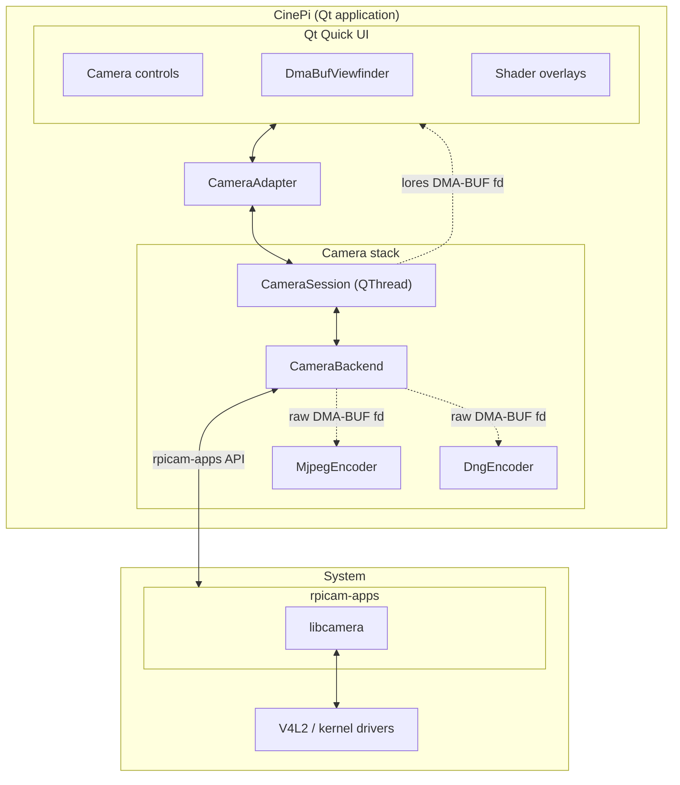

***Open-source cinema camera platform for Raspberry Pi - Kurokesu edition of [CinePI](https://github.com/cinepi/cinepi-sdk)***


# Overview

A fork and evolution of CinePI. Built on the libcamera API directly. Camera capture, DNG encoding, and Qt Quick UI all run in a single process with DMA-BUF zero-copy preview.

- **Qt Quick UI** running in Cage Wayland kiosk
- **DMA-BUF viewfinder** - zero-copy camera preview via EGL/GLES
- **12-bit CinemaDNG RAW** recording to NVMe SSD
- **GPU shader overlays** - zebra, false color, focus peaking, grayscale
- **Composition guides** - rule of thirds, crosshair, cinematic aspect ratios
- **MJPEG streaming** for remote monitoring

# Supported hardware

CinePI cameras are based around Raspberry Pi hardware / software.

1st party camera modules from Raspberry Pi are supported out of the box. 3rd party sensor modules from [Will Whang](https://github.com/will127534) and [Soho Enterprise](https://soho-enterprise.com/) are also supported.

## Mainboards

- Raspberry Pi 5 (4 GB / 8 GB)

## Image sensor modules


*HQ Camera Module, StarlightEye, OneInchEye, SE-SB8M-IMX585*
- [Raspberry Pi HQ Camera ( IMX477 )](https://www.raspberrypi.com/products/raspberry-pi-high-quality-camera/)
- [Raspberry Pi Camera Module 3 ( IMX708 )](https://www.raspberrypi.com/products/camera-module-3/)
- [OneInchEye ( IMX283 )](https://github.com/will127534/OneInchEye)
- [StarlightEye ( IMX585 )](https://github.com/will127534/StarlightEye)

# Getting started

## Setup

1. Flash [Raspberry Pi OS Lite Trixie](https://www.raspberrypi.com/software/) (64-bit, Debian 13) to a microSD card.

2. Clone and install:

```bash
git clone https://github.com/Kurokesu/kurokesu-cinepi.git
cd kurokesu-cinepi
./install.sh
```

Installer will:

- Install system dependencies (Qt6, Cage, libcamera, rpicam-apps, EGL/GLES)
- Build the `cinepi` binary
- Set up `cinepi.service` (Cage kiosk, auto-starts on boot)
- Configure NVMe storage mount
- Install Plymouth splash screen

3. Configure sensor - edit `/boot/firmware/config.txt`:

```ini
camera_auto_detect=0

[all]
dtoverlay=imx283
#dtoverlay=imx477
#dtoverlay=imx585
```

> [!NOTE]
> Sensors default to **cam1** port. To use cam0, append `,cam0`:
> ```ini
> dtoverlay=imx283,cam0
> ```

4. Reboot:

```bash
sudo reboot
```

`cinepi.service` starts automatically on boot.

## Testing

Start manually if needed:

```bash
sudo systemctl start cinepi.service
sudo systemctl status cinepi.service
```

MJPEG stream is available at `http://cinepi.local:8000/stream` from any browser on the same network.

# Development

Build and run locally:

```bash
./scripts/build.sh release
./scripts/run.sh
```

`run.sh` detects the environment automatically - if a Wayland compositor is already running (desktop), it connects directly. Otherwise it launches via Cage.

Stop:

```bash
./scripts/stop.sh
```

Debug build:

```bash
./scripts/build.sh debug
./scripts/run.sh debug
```

# Architecture



# Sensor compatibility

## Cropped resolution and utilization per aspect ratio

| Ratio | IMX283 (3:2) | IMX585 (16:9) | IMX477 (4:3) |
|-------|-------------|--------------|-------------|
| 2.39:1 (Scope) | 5496 × 2300 (63%) | 3840 × 1607 (74%) | 4056 × 1697 (56%) |
| 2.2:1 (70 mm) | 5496 × 2498 (68%) | 3840 × 1745 (81%) | 4056 × 1844 (61%) |
| 1.85:1 (Theatrical) | 5496 × 2971 (81%) | 3840 × 2076 (96%) | 4056 × 2192 (72%) |
| 16:9 | 5496 × 3091 (84%) | **3840 × 2160 (100%)** | 4056 × 2282 (75%) |
| 3:2 | **5496 × 3672 (100%)** | 3240 × 2160 (84%) | 4056 × 2704 (88%) |
| 1.37:1 (Academy) | 5030 × 3672 (92%) | 2959 × 2160 (77%) | 4056 × 2960 (97%) |
| 4:3 | 4896 × 3672 (89%) | 2880 × 2160 (75%) | **4056 × 3040 (100%)** |

**Bold** = native ratio, no crop needed.

## Preview display (720 × 720 HyperPixel, 520 px preview height)

| Ratio | Frame size | Fits 520 px? | Display method |
|-------|-----------|-------------|----------------|
| 2.39:1 | 720 × 301 | Yes | Letterboxed |
| 2.2:1 | 720 × 327 | Yes | Letterboxed |
| 1.85:1 | 720 × 389 | Yes | Letterboxed |
| 16:9 | 720 × 405 | Yes | Letterboxed |
| 3:2 | 720 × 480 | Yes | Letterboxed |
| 1.37:1 | 713 × 520 | Pillarboxed | -7 px width |
| 4:3 | 693 × 520 | Pillarboxed | -27 px width |

# Configuration

## Sensor tuning

`scripts/run.sh` passes environment variables to the `cinepi` binary:

```bash
TUNING_FILE=~/kurokesu-cinepi/tuning/imx477.json ./scripts/run.sh
SENSOR_MODE=1920:1080:10:U ./scripts/run.sh
LORES_WIDTH=1280 LORES_HEIGHT=720 ./scripts/run.sh
```

Custom tuning files are in the `tuning/` directory.

# Discussion

[](https://discord.gg/zGMuSUF5er)
[](https://github.com/cinepi/cinepi-sdk/discussions)

# Credits

- [CinePI](https://github.com/cinepi/cinepi-sdk) - original Pi cinema camera platform
- [ALTCINECAM](https://github.com/ALTCINECAM) - alternative CinePI distribution
- [Will Whang](https://github.com/will127534) - OneInchEye (IMX283) and StarlightEye (IMX585) sensor modules
